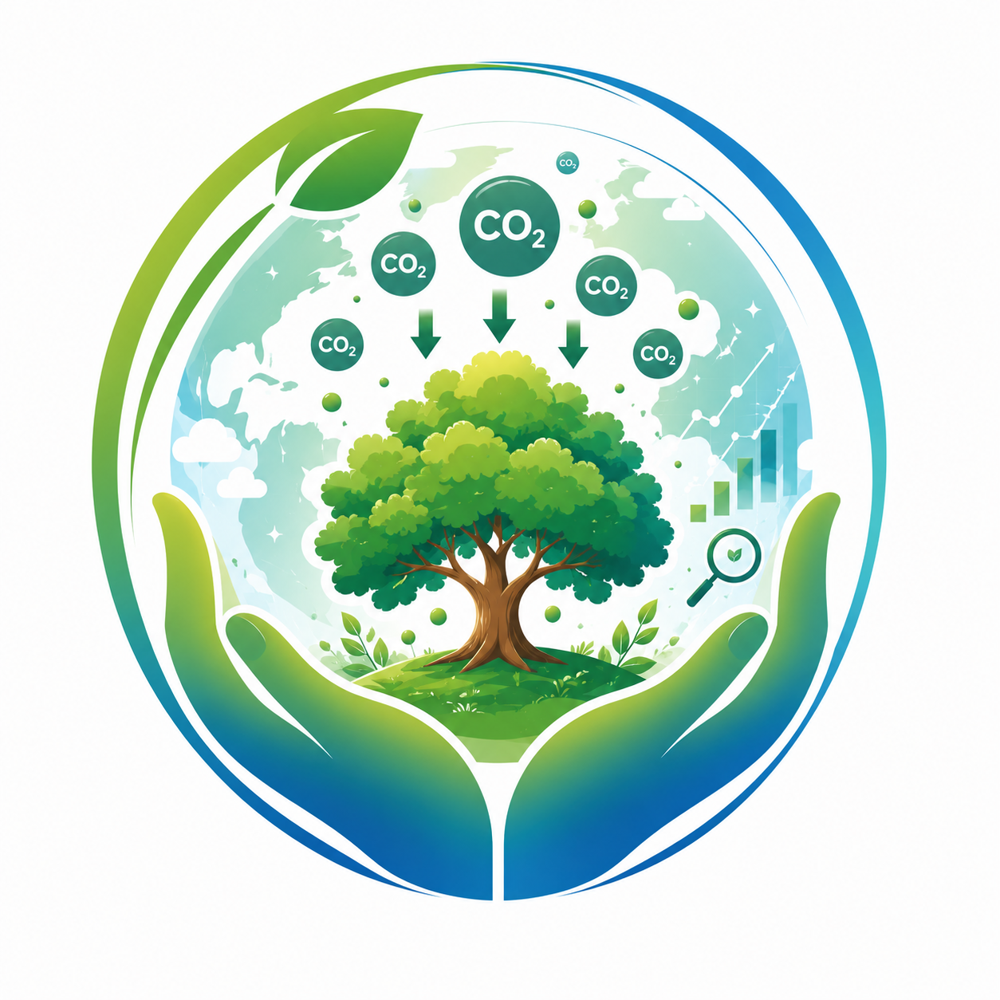
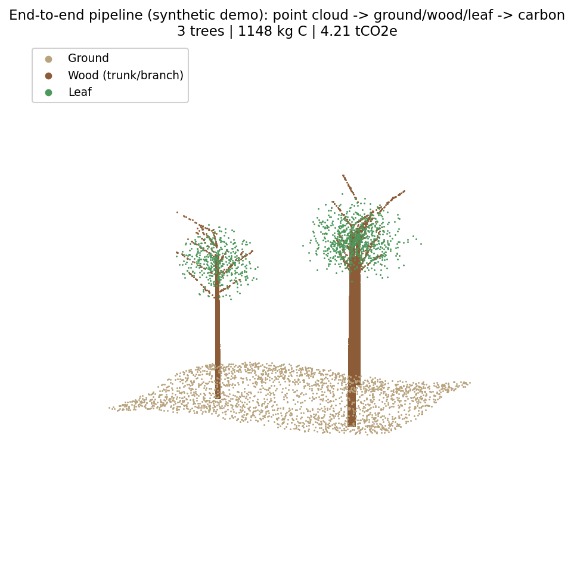
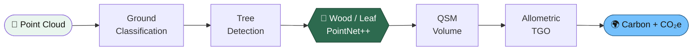
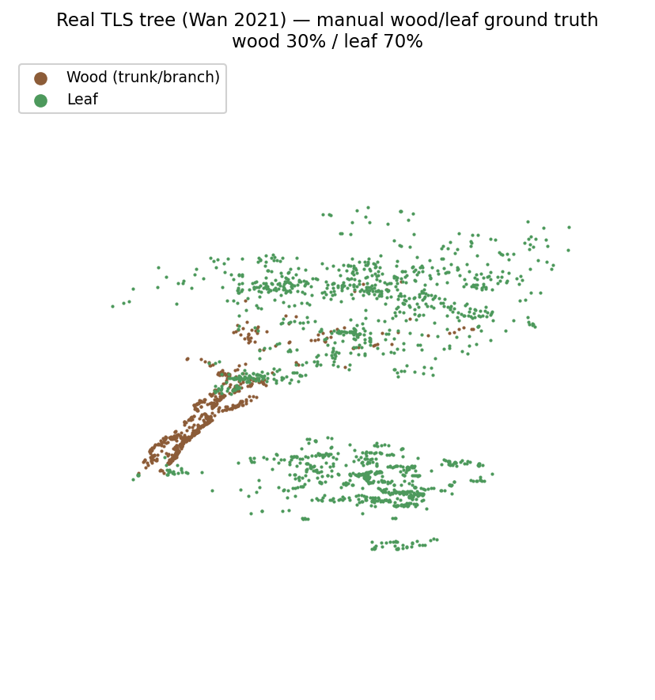
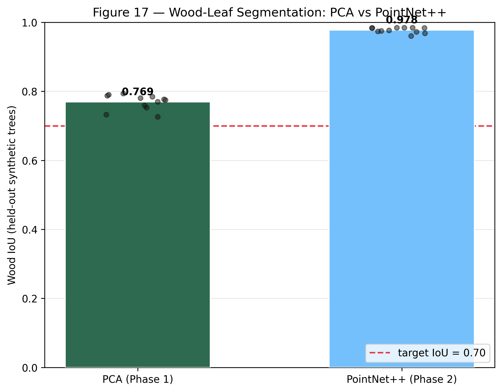

<div align="center">



# 🌲 CarbonScan AI

### วัดคาร์บอนต้นไม้ด้วย LiDAR + AI — โปร่งใส ตรวจสอบได้ ต้นทุนถูกลงได้ถึง **100×**

<em>Forest meets Code · ประเมินคาร์บอนเครดิตชีวมวลจาก 3D Point Cloud ด้วย Wood-Leaf Segmentation (Deep Learning) + B2B Carbon Offset Matchmaking</em>

<br/>

[](https://www.nstda.or.th/sims)
[]()
[](LICENSE)
[](https://github.com/Remote55/carbonscan-ai/commits/main)

[](https://nextjs.org)
[](https://fastapi.tiangolo.com)
[](https://flutter.dev)
[](https://pytorch.org)
[](https://postgis.net)

[](https://github.com/Remote55/carbonscan-ai/actions/workflows/ci-ml.yml)
[](https://github.com/Remote55/carbonscan-ai/actions/workflows/ci-api.yml)
[](https://github.com/Remote55/carbonscan-ai/actions/workflows/ci-web.yml)
[](https://github.com/Remote55/carbonscan-ai/actions/workflows/codeql.yml)

<br/>



<sub><em>จากกลุ่มจุด 3 มิติ → แยก ground / wood / leaf → คำนวณคาร์บอน (ตัวอย่างผลลัพธ์จาก pipeline จริง)</em></sub>

</div>

---

## 💡 ปัญหา &nbsp;→&nbsp; ทางออก

|  |  |
|---|---|
| 🔴 **ปัญหา** | ประเมินคาร์บอนเครดิตป่าไม้ไทยต้องจ้าง Auditor ราว **฿100,000/แปลง** → ชุมชนเข้าไม่ถึง โรงงาน CSR ตรวจสอบเองไม่ได้ เสี่ยง Greenwashing |
| 🟢 **ทางออก** | อัปโหลด point cloud (LiDAR หรือ **รูปมือถือ 30–50 ใบ → photogrammetry**) → **AI แยกใบ/ลำต้น** → คำนวณคาร์บอนด้วยสมการ TGO → ตรวจสอบผ่าน **3D Viewer + GPS** |
| ✨ **ผลลัพธ์** | ต้นทุนลดลงราว **100×** · โปร่งใส ตรวจสอบได้ทุกจุด · เชื่อม B2B Carbon Offset |

---

## 🔬 Machine Learning Pipeline (8 ขั้น)



---

## 📊 ผลลัพธ์ — validated & honest

**Geometry pipeline · ตรวจสอบกับข้อมูลจริงที่โค่นจริง** (Demol et al. 2021, TLS 65 ต้น, independent test):

<div align="center">

| Metric | ค่าคลาดเคลื่อน (MAE) |
|:--|:--:|
| 📏 DBH (เส้นผ่านศูนย์กลางที่อก) | **1.17 cm** |
| 📐 Tree Height (ความสูง) | **0.54 m** |

</div>

**Wood-Leaf Segmentation (PointNet++)** — รายงานผลบนไม้จริงตรงไปตรงมา ไม่เคลมเฉพาะเลข synthetic:

<div align="center">

| ทดสอบบน | Wood IoU | Mean IoU |
|:--|:--:|:--:|
| Synthetic (held-out) | **0.978** | — |
| ไม้จริง Wan 2021 · zero-shot | 0.18 | 0.33 |
| ไม้จริง Wan 2021 · **train-on-real + augment** | **0.42** | **0.61** |


&nbsp;


</div>

> การฝึกบนไม้จริงโดยตรง (same-environment) + augment ยก Mean IoU จาก 0.33 → **0.61** — ช่องว่างที่เหลือปิดด้วยการเก็บ field data ไม้ไทยเพิ่ม (Phase ถัดไป)

---

## 🧠 Highlights

- 🎯 **End-to-end จริง** — `POST /api/v1/upload/analyze` รับ point cloud → คืน carbon JSON (per-tree DBH / height / volume / carbon)
- 🌐 **3D Viewer** (React Three Fiber) โหลด segmented `.ply` โชว์สี wood / leaf / ground หมุน–ซูมได้
- 🧪 **วินัยวิศวกรรม** — TDD · CI (ML/API/Web/Mobile) · CodeQL · ~95 tests สีเขียว
- 📱 **Dual-input** — รองรับทั้ง LiDAR upload และ photogrammetry (ไม่ต้องมีเครื่อง LiDAR แพง)
- 🔍 **Open & reproducible** — ใช้ open datasets (Demol 2021, Wan 2021) อ้างอิงชัด สัญญาอนุญาต CC-BY

---

## 🛠 Tech Stack

| Layer | Technology |
|---|---|
| **Web** | Next.js 14 · TypeScript · Tailwind · shadcn/ui · Three.js (R3F) · Leaflet |
| **Mobile** | Flutter 3.x · Riverpod · TFLite · Dio |
| **Backend** | FastAPI (Python 3.11) · Pydantic v2 · SQLAlchemy 2.0 async · asyncpg |
| **Database** | PostgreSQL 16 + PostGIS (Supabase) |
| **AI / ML** | PyTorch · PointNet++ · Open3D · laspy · COLMAP · OpenMVS |
| **Cloud** | Vercel (Web) · Railway (API) · RunPod Serverless GPU · Supabase |
| **DevOps** | pnpm workspaces · Turborepo · Docker · GitHub Actions |

---

## 🚀 Quick Start

```bash
git clone https://github.com/Remote55/carbonscan-ai.git
cd carbonscan-ai

# ML pipeline → point cloud เป็น carbon (CLI)
cd services/ml && python -m pipeline.main process --input plot.las --output result.json

# Backend API (analyze endpoint)
cd services/api && uvicorn app.main:app --reload      # → http://localhost:8000/docs

# Web dashboard + 3D viewer
cd apps/web && pnpm dev                                # → http://localhost:3000
```

> คนใหม่ในทีม? เริ่มที่ **[docs/ONBOARDING.md](docs/ONBOARDING.md)** (30 นาที)

---

## 📂 Structure

```
carbonscan-ai/
├── apps/
│   ├── web/          Next.js 14 dashboard + 3D viewer
│   └── mobile/       Flutter app
├── services/
│   ├── api/          FastAPI backend
│   └── ml/           AI/ML pipeline (PyTorch, PointNet++)
├── packages/         shared ui / types / design-tokens
└── docs/             architecture · ML · proposal · figures
```

---

## 👥 Team

| Member | Role | Focus |
|---|---|---|
| **Lead** | AI · Mobile · Backend | `services/ml` · `services/api` · `apps/mobile` |
| **Person A** | Frontend | `apps/web` · 3D viewer · GIS map |
| **Person B** | UI/UX · Branding | `assets/brand` · design system |

---

## 🗺 Roadmap

| Phase | Status |
|---|---|
| **Phase 1** — Pipeline + validation (Belgium) + Web/API MVP | ✅ |
| **Phase 2** — PointNet++ wood-leaf + real-data training | 🟢 กำลังทำ |
| **Phase 3** — Photogrammetry (smallholder) + Thai field data | 🔜 |
| **Phase 4** — B2B Carbon Offset marketplace | 🔜 |

<details>
<summary>📚 <b>Documentation map</b></summary>

| Doc | Purpose |
|---|---|
| [docs/ARCHITECTURE.md](docs/ARCHITECTURE.md) | System design |
| [docs/ml/PIPELINE.md](docs/ml/PIPELINE.md) | ML pipeline (8 steps) |
| [docs/ml/FINETUNE_REALDATA.md](docs/ml/FINETUNE_REALDATA.md) | Real-data training runbook |
| [docs/ml/WOODLEAF_RESULTS.md](docs/ml/WOODLEAF_RESULTS.md) | Wood/leaf results log |
| [docs/API.md](docs/API.md) · [docs/DATA_MODEL.md](docs/DATA_MODEL.md) | API + DB schema |
| [docs/decisions/](docs/decisions/) | ADRs |
| [proposal/](proposal/) | NSC 2026 proposal docs |

</details>

---

## 🙏 Acknowledgments

**lidR** (Roussel et al.) · **Demol et al. 2021** & **Wan et al. 2021** (open TLS datasets) · **TGO** (allometric standards) · **NSC 2026 / สวทช.**

## 📜 License

[MIT](LICENSE) © CarbonScan AI Team

<div align="center"><sub>🌲 Built for <b>NSC 2026</b> · Forest meets Code</sub></div>
