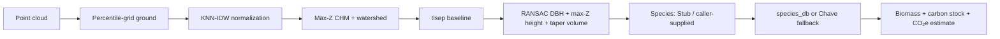

<div align="center">

# TreeQ Carbon Platform

### ประเมินชีวมวล คาร์บอน และ CO₂e ของต้นไม้จาก 3D point cloud พร้อมหลักฐานที่ตรวจสอบย้อนกลับได้

<em>NSC 2026 หมวด 14 · Evidence-gated ML · 3D visual verification</em>

[](https://www.nstda.or.th/sims)
[](LICENSE)
[](https://github.com/Remote55/carbonscan-ai/actions/workflows/ci-ml.yml)
[](https://github.com/Remote55/carbonscan-ai/actions/workflows/ci-api.yml)
[](https://github.com/Remote55/carbonscan-ai/actions/workflows/ci-web.yml)

</div>

---

## โปรเจกต์นี้ทำอะไร

TreeQ Carbon Platform รับ point cloud (`.las/.laz/.ply`) แล้วประมวลผลเป็นรายต้น:

1. แยกพื้นด้วย percentile-grid heuristic
2. normalize ความสูงด้วย KNN-IDW
3. สร้าง CHM แบบ max-Z + morphology
4. แยกต้นด้วย watershed
5. แยก wood/leaf ด้วย `tlsep` baseline
6. วัด DBH ด้วย RANSAC, ความสูงด้วย max-Z และปริมาตรลำต้นแบบ taper
7. รับชนิดไม้จากผู้เรียก เพราะ species classifier ยังเป็น Stub
8. คำนวณ biomass, carbon stock และ CO₂e จาก `species_db.csv` หรือ Chave 2014 fallback

ผลลัพธ์คือค่าประมาณคาร์บอนที่มี provenance ของ input, Git commit, pipeline version,
อัลกอริทึม และ checkpoint ไม่ใช่ carbon credit ที่ผ่านการรับรองหรือพร้อมซื้อขาย



## สถานะที่ยืนยันได้

| Capability | Status | ข้อเท็จจริง |
|---|---|---|
| ML core path | Implemented | เส้นทาง `tlsep` รันซ้ำได้พร้อม JSON/PLY hashes |
| PointNet++ | Experimental | มีผลวิจัย แต่ยังไม่ผ่าน independent final-test และ downstream non-regression gate |
| Species classifier | Stub | ยังไม่มี ResNet ที่เทรนและ integrate จริง |
| Allometric calculation | Implemented | ใช้ `services/ml/data/species_db.csv` และ Chave fallback; ยังต้อง verify coefficients กับ TGO 2017 |
| FastAPI `/upload/analyze` | Implemented | synchronous — คืนผลเต็มในคำตอบเดียว คิว async ถูกถอดออกเพราะไม่มีผู้เรียกและไม่มี deployment ใดสตาร์ท worker |
| Web 3D viewer | Implemented | แสดง segmented PLY และ run provenance |
| Mobile capture flow | Experimental | มี Flutter screens แต่ Supabase init และ reviewed E2E ยังไม่ครบ |
| Production API hosting | Planned | demo ปัจจุบันอาศัย local backend/tunnel |
| GIS, anti-fraud, marketplace, payment, certificate | Planned | เป็น roadmap ไม่ใช่ prototype ที่เสร็จแล้ว |

รายละเอียดทั้งหมดสร้างจาก reviewed manifest ที่
[`docs/evidence/core_demo_manifest.json`](docs/evidence/core_demo_manifest.json) และสรุปใน
[`docs/CAPABILITY_MATRIX.md`](docs/CAPABILITY_MATRIX.md)

## ตัวเลขที่ต้องรายงานตรงไปตรงมา

### Wood/leaf — PointNet++ Experimental

Wan 2021 spatial held-out loader:

| Metric | ค่าที่บันทึก |
|---|---:|
| Wood IoU | **0.418** |
| Leaf IoU | **0.808** |
| Mean IoU | **0.613** |
| Accuracy | **0.831** |

ข้อจำกัดสำคัญ: held-out loader เดียวกันถูกใช้เลือก best epoch และไม่มี checkpoint/tree-ID provenance
ครบพอสำหรับ independent final-test gate จึงห้ามโปรโมต PointNet++ เป็น default จากตัวเลขชุดนี้

### Geometry — Demol 2021 isolated-tree validation, 65 ต้น

| Metric | ค่าที่บันทึก |
|---|---:|
| DBH MAE | **0.898318 cm** |
| Height MAE | **0.543323 m** |
| Volume MAPE | **11.520556%** |

การทดสอบนี้เริ่มจาก isolated-tree cloud ที่จำกัด 20,000 points, normalize ด้วย min-Z และใช้ `tlsep`
จึงไม่ใช่ validation ของขั้น 1–4, species classification, allometric biomass, carbon stock หรือ carbon credit

## Evidence gate

`tlsep` เป็น default ที่เสถียร ส่วน PointNet++ จะถูกโปรโมตได้ก็ต่อเมื่อหลักฐานครบทุกข้อ:

- checkpoint มี SHA-256 และ training provenance ครบ
- เป็น independent real-data test ที่รันซ้ำได้
- Wood IoU สูงกว่า baseline
- DBH MAE, Height MAE และ Volume MAPE ไม่แย่ลง
- จำนวนต้นที่วัดได้ไม่ลดลง

Gate ทำงานแบบ fail-closed ใน `services/ml/pipeline/provenance.py`

## Deterministic core demo

Reviewed run ที่ commit `8cf3058c1f618b5ec0cac7fb5cd9fa3feea40e67` ใช้ clean worktree,
synthetic seed 42 และ `tlsep` ได้ 3 ต้น, 1036.09 kg C และ 3798.99 kg CO₂e
ตัวเลขนี้ใช้ยืนยัน reproducibility เท่านั้น ไม่ใช่ accuracy benchmark

```powershell
cd services/ml
python scripts/run_core_demo.py --output-dir ../../temp/core-demo --repo-root ../..
cd ../..
python scripts/sync_truth.py --check
```

## Quick start

### ML

```powershell
cd services/ml
python -m venv .venv
.\.venv\Scripts\Activate.ps1
pip install -e ".[dev]"
pytest tests/
python -m pipeline.main process --input plot.las --output result.json --backend tlsep
```

### API

```powershell
cd services/api
python -m venv .venv
.\.venv\Scripts\Activate.ps1
pip install -e .
pytest
python -m uvicorn app.main:app --host 127.0.0.1 --port 8000
```

### Web

```powershell
cd apps/web
npm install
npm run dev
npm test -- --run
npm run type-check
npm run build
```

## โครงสร้าง repo

```text
apps/web/        Next.js landing, dashboard และ 3D viewer
apps/mobile/     Flutter capture/results prototype
services/api/    FastAPI synchronous analyze endpoint
services/ml/     8-stage point-cloud pipeline, training และ evaluation
docs/            master spec, ML evidence, capability matrix และ decisions
proposal/        เอกสารข้อเสนอโครงงาน NSC
scripts/         truth sync และ report builder
```

## Deployment

| ส่วน | สถานะ |
|---|---|
| Web | Vercel: `treeqcarbon.vercel.app` |
| API + ML worker | ยังไม่มี production deployment; demo ใช้ local backend ผ่าน temporary tunnel |
| DB/Auth | Supabase |

## งานถัดไป

1. สร้าง independent real-data evaluation ที่เปรียบเทียบ `tlsep` กับ PointNet++ ด้วย input และ downstream metrics ชุดเดียวกัน
2. หาและ verify open wood/leaf dataset เพิ่ม แล้วเก็บ checkpoint/training provenance ให้ครบ
3. verify allometric coefficients กับเอกสาร TGO 2017 ต้นฉบับ
4. deploy API + worker บน shared persistent storage หรือเปลี่ยน job input เป็น object storage
5. ปิด reviewed mobile E2E ก่อนเริ่ม marketplace/GIS/certificate

## เอกสารหลัก

- [`docs/DOCUMENT_STATUS.md`](docs/DOCUMENT_STATUS.md) — แยก current truth, target และ historical documents
- [`AGENTS.md`](AGENTS.md) — กติกาและคำสั่งทำงาน
- [`docs/PROJECT_SPEC.md`](docs/PROJECT_SPEC.md) — context โครงการฉบับเต็ม
- [`docs/ml/PIPELINE.md`](docs/ml/PIPELINE.md) — อัลกอริทึม 8 ขั้นตามโค้ด
- [`docs/ml/WOODLEAF_RESULTS.md`](docs/ml/WOODLEAF_RESULTS.md) — บันทึกผล wood/leaf และข้อจำกัด
- [`docs/ml/ALLOMETRIC.md`](docs/ml/ALLOMETRIC.md) — สมการและแหล่งข้อมูล

## License

[MIT](LICENSE) © TreeQ Carbon Platform Team
